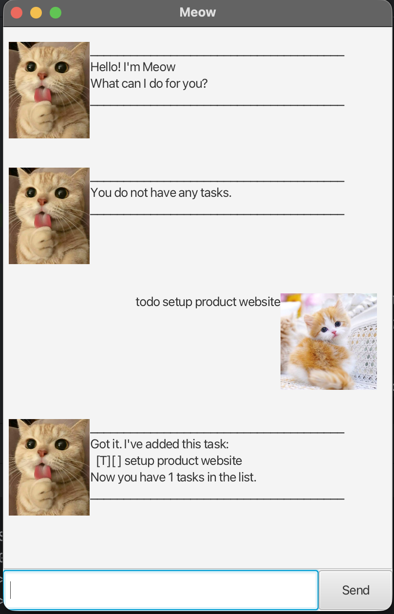

# MeowBot User Guide

MeowBot is a chatbot app for managing tasks. You can type messages to interact with the chatbot. If you can type fast, MeowBot can track your tasks more quickly than traditional GUI apps.

## Product Screenshot



---

## Adding todos

Adds a to-do task.

**Format:** `todo DESCRIPTION`

* The character `|` cannot be used in the description.

**Example:** `todo sweep floor`

**Expected output:**
```
______________________________________
Got it. I've added this task:
[T][ ] sweep floor
Now you have 1 tasks in the list.
______________________________________
```

---

## Adding deadlines

Adds a task with a deadline.

**Format:** `deadline DESCRIPTION /by DATETIME`

* The character `|` cannot be used in the description.
* Datetime should be in the format `yyyy-MM-dd`.
* Example format: `2026-02-20` (year-month-day)

**Example:** `deadline read book /by 2026-02-20`

**Expected output:**
```
______________________________________
Got it. I've added this task:
[D][ ] read book (by: Feb 20 2026)
Now you have 2 tasks in the list.
______________________________________
```

---

## Adding events

Adds a task with a start and end date.

**Format:** `event DESCRIPTION /from DATETIME /to DATETIME`

* The character `|` cannot be used in the description.
* Datetime should be in the format `yyyy-MM-dd`.
* The fields `/from` and `/to` may be in any order.

**Example:** `event walk the dog /from 2026-02-20 /to 2026-02-21`

**Expected output:**
```
______________________________________
Got it. I've added this task:
[E][ ] walk the dog (from: Feb 20 2026 to: Feb 21 2026)
Now you have 3 tasks in the list.
______________________________________
```

---

## Listing all tasks

Shows a list of all tasks.

**Format:** `list`

**Example:** `list`

**Expected output:**
```
______________________________________
Here are the tasks in your list:
1.[T][ ] sweep floor
2.[D][ ] read book (by: Feb 20 2026)
3.[E][ ] walk the dog (from: Feb 20 2026 to: Feb 21 2026)
______________________________________
```

---

## Marking tasks

Marks a task as completed.

**Format:** `mark INDEX`

* The index refers to the index number shown in the task list.
* The index must be a positive integer 1, 2, 3, ...

**Example:** `mark 1`

**Expected output:**
```
______________________________________
Nice! I've marked this task as done:
[T][X] sweep floor
______________________________________
```

---

## Unmarking tasks

Marks a task as uncompleted.

**Format:** `unmark INDEX`

* The index refers to the index number shown in the task list.
* The index must be a positive integer 1, 2, 3, ...

**Example:** `unmark 1`

**Expected output:**
```
______________________________________
OK, I've marked this task as not done yet:
[T][ ] sweep floor
______________________________________
```

---

## Deleting tasks

Deletes a task from the task list.

**Format:** `delete INDEX`

* The index refers to the index number shown in the task list.
* The index must be a positive integer 1, 2, 3, ...

**Example:** `delete 1`

**Expected output:**
```
______________________________________
Noted. I've removed this task:
  [T][ ] sweep floor
Now you have 2 tasks in the list.
______________________________________
```

---

## Finding tasks

Finds tasks with the given keyword(s) in the description.

**Format:** `find KEYWORD [KEYWORD...]`

* The search is case-insensitive.
* Only the description is searched.
* Partial string matching is supported (e.g., `boo` will match `book`).
* Multiple keywords can be provided, separated by spaces.
* Tasks matching ANY of the keywords will be returned (OR logic).

**Examples:**
* `find book` returns all tasks containing "book"
* `find book sports` returns all tasks containing "book" OR "sports"

**Expected output:**
```
______________________________________
Here are the matching tasks in your list:
1.[T][ ] read book
2.[D][ ] return book (by: Feb 20 2026)
______________________________________
```

---

## Exiting the program

Exits the program.

**Format:** `bye`

* The program will automatically close after you press the Enter key.
* All tasks are automatically saved when you exit.

---

## Saving the data

MeowBot data is saved in the hard disk automatically when you send the `bye` command. Closing the program before sending `bye` will discard all changes made to the task list.

Task data is stored in: `data/meow.txt`

---
